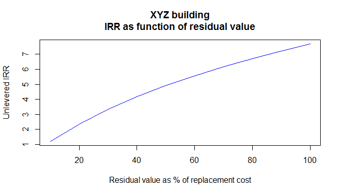
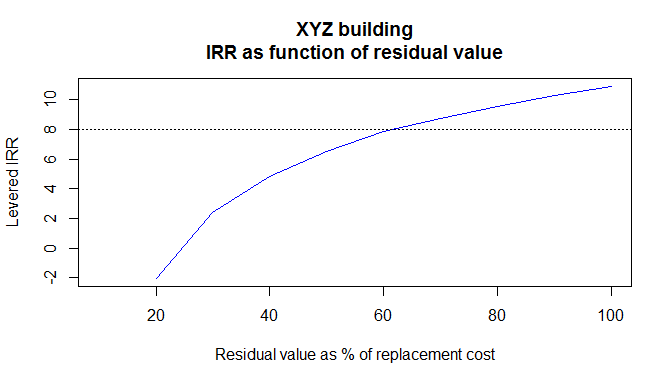

# Triple Net Lease Example

In a long term high credit triple net lease, the main underwriting risk for the investor is the residual value at the end of the lease.  

Calculate IRR sensitivities assuming 15 year hold and with sensitivities to residual value.

Assume replacement cost = $120 per sq ft plus 2% inflation.

First calculate unlevered.

Then calculate levered with 50% leverage, 5.5% fixed, interest only

All IRRs are after fees and promote


```r
#unlevered cash flow normalized to $1000 investment
cost=-1000
#calculate rent for 15 years growing at 1.5%
rent=grow(66,15,.015)
#property management
pm=0*rent
#asset management
am.unl=(-.005*cost)+(.0425*(rent-pm))
#calculate unlevered noi
noi.unl=rent-pm-am.unl
#residual value as % of replacement cost, assume 2% inflation on construction
replacement=(-cost*1.25*1.02^15)
residual.pct=seq(.1,1,.1)
residual=residual.pct*replacement
#create function to calculate irr as sensitivity to residual value
irr.unl.fun=function(x) {
  prefcalc=(lineofcredit(noi.unl,.08,cost))
  capitalpluspref=tail(prefcalc$endbal,1)
  promote=.2*max(0,x-capitalpluspref)
  cf=(c((cost),noi.unl[1:14],(noi.unl[15]+x-promote)))
  cf.z=zoo(cf,as.Date("2014-1-1")+years(0:15))
  irr.z(cf.z)
  } 
#calculate the IRRs as function of residual value
irr.unl=sapply(residual,FUN=irr.unl.fun)
#do residual value plot
plot(100*residual.pct,residual.pct*(120*1.02^15),type='l',col='blue',
     main="XYZ building",
     xlab="Residual value as % of replacement cost",
     ylab="Residual vaue per square foot")
abline(h=90,lty=3)
```

<!-- -->

```r
#plot the unlevered IRRs
plot(100*residual.pct,100*irr.unl,type='l',col='blue',
     main="XYZ building\nIRR as function of residual value",
     ylab="Unlevered IRR",
     xlab="Residual value as % of replacement cost")
abline(h=8,lty=3)
```

<!-- -->

```r
#now add leverage
#interest rate is 15 yr swap plus 218 bp
i.rate=.055
loan.bal=.5*cost
interest=-i.rate*loan.bal
am.lev=(-.005*(cost-loan.bal))+(.0425*(rent-pm))
noi.lev=rent-pm-am.lev-interest
irr.lev.fun=function(x) {
  prefcalc=(lineofcredit(noi.lev,.08,loan.bal-cost))
  capitalpluspref=tail(prefcalc$endbal,1)
  promote=.2*max(0,x+loan.bal-capitalpluspref)
  cf=(c((cost-loan.bal),noi.lev[1:14],(noi.lev[15]+x+loan.bal-promote)))
  cf.z=zoo(cf,as.Date("2014-1-1")+years(0:15))
  irr.z(cf.z)
  }  
irr.lev=sapply(residual,FUN=irr.lev.fun)
plot(100*residual.pct,100*irr.lev,type='l',col='blue',
     main="XYZ building\nIRR as function of residual value",
     ylab="Levered IRR",
     xlab="Residual value as % of replacement cost")
abline(h=8,lty=3)
```

<!-- -->


