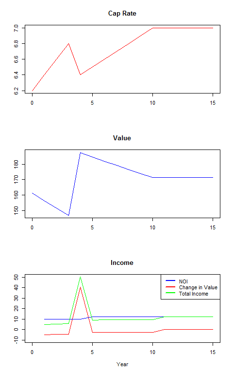
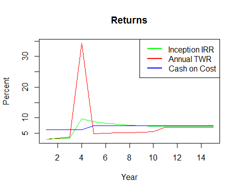

# Underwriting an existing building
Karl Polen  
Friday, April 03, 2015  

## ASRS Underwriting Standards for acquisition of existing buildings

ASRS has entered in to a series of separately managed accounts with real estate asset managers.  The venture agreement specifies investment criteria for acquisitions and the asset manager is granted "discretion in a box" to acquire assets provided they meet the investment criteria.  ASRS retains a consultant to certify each asset complies with the investment criteria prior to acquisition.

These are draft underwriting standards for the acquisition of existing buildings.  Upon adoption, consultant will include an underwriting checklist in their final report indicating that they have completed the underwriting procedures described in this document.

## Goals of underwriting process

Underwriting consists of research and fieldwork to gain a deep underestanding of an asset in order to form a view about its likely future performance.  The work product of underwriting is a narrative report and a model describing the asset and expressing views and forecasts about the asset.

While the underwriting is done in the context of this certification, there are multiple goals to the underwriting.  Following is a summary of goals of the underwriting process

  * Describe the asset
  
    + its physical characteristics and attractiveness to tenants
    + desirableness of location in market context
    + neighborhood context and competitive dynamic with existing and proposed competition
    
  * Determine if an asset complies with the relevant investment criteria
  * Provide an unbiased forecast of the expected future performance of the asset
  * Identify risks that could cause the performance to be higher or lower than the forecast
  
    + perform sensitivity analysis in realistic ranges to reflect one and two sigma (standard deviation) events such that the result of the sensitivy analysis is an estimated confidence interval
    + treat ASRS IRR as the "objective function" for this sensitivity analysis
    
  * Present results in a format consistent with ASRS financial reporting and performance measurement standards to facilitate later comparison of actual results to the forecast
  * Create information for the ASRS dynamic risk management system that forecasts the evolution of the quarterly ASRS NAV through risk categories as the busines plan is implemented
  
## Assets and Hold Periods

For every asset, we want to model a long term hold period even if the strategy is to trade the asset at some point.  The advantage to modeling a longer hold is (a) it allows for modeling sensitivity on time frames as a risk factor in achieving business plans and (b) it highlights the risk of long term ownership in a cyclical trading asset if you miss the window for sale.

### *Evolution of returns and risk*

Generally speaking, we are buying assets that are not currently stable and have some sort of value creation story.  As an asset moves through its value creation process, its risk and required returns change. We will illustrate through a simple example the measurement of returns on asset through time.

Suppose we own a single tenant triple net leased building.  It has 5 years left on a 20 year lease with current income of $10.   The tenant has an option to renew at "market".  We expect the tenant to renew, but there is uncertainty what "market" will be.  At the current time we estimate rents will increase to $12 upon renewal (and for the sake of simplicity we will assume no capex upon renewal).  Market cap rates for a stable building are 6%, but we believe that with reversion to a more normal interest rate environment that will gradually increase to 7% over the next ten years.  However, the cap rate for this building carries a risk premium because of the lease renewal uncertainty.  We estimate that risk premium at 20bp currently and believe that grows 10bp per year until the lease renews.

This is about as simple scenario as we will ever consider, yet it creates a fairly complex patter of returns.  We wil present the results in a series of graphs.

First we show the evolution of the value of the building given the project NOI and changing cap rates.  We add a graph that shows the cash NOI, the change in value and total return (which is the cash NOI plus the change in value).

<!-- -->

<!-- -->

Now we can express these facts as returns.  The above chart shows the cash return on cost, the annual time weighted return and the inception IRR.  Returns start low because the value of the asset is deteriorating with less and less time remaining on the lease.  As you would expect, there is a "pop" in the returns when you renew.  Over time, all the returns converge to the cash return.

We are never interested in just a point estimate of these returns.  What we are looking for is to understand the shape of the curve as the returns evolve.  We will focus on the peak IRR and how long it takes to achieve it.  How low are the initial returns while we waiting for the opportunity to make a profit.  At what level does does the IRR stabilize (if it does).  Or is this a cyclical asset where we expect to have ups and downs due to leasing or a construction cycle.

When doing sensitivity analysis, it makes sense to do the sensitivity analysis at the inflection points -- the peak, the trough (if there is one) and at stabilization.

### *The narrative of an asset*

The executive summary should open with a concise narrative description of the business opportunity of the asset.  What risk are we taking that we think gives us the opportunity to make an attractive profit?  This narrative is the hypothesis that go one to test with detailed diligence.  It states the risk factors that will later be the subject of our sensitivity analysis.

You should be able to express this very concisely.  Real estate is not that complicated and there are only so many scenarios.  Some examples:

  * We are buying a leased asset with below market rents and we think we can increase the rents at renewal.
  * We are buying a cyclical asset and think we can increase rents and sell the assets before the next downward trend in the cycle.
  * We are buying vacancy and think we can lease it.
  * We are buying a leased asset with deferred maintenance and think tenants will tolerate higher rent if we fix the place up.
  * We can reposition the asset to a more up scale market.
  * We can cut cost without hurting revenue.
  * We can expand the square footage available for lease by modifying the building.
  * We can change to a higher value use.
  
Once you express the business in your narrative write up, the model should be consistent with and illustrate the narrative.  Use labels and provide detail in the model that illustrate and support the business case. Create scenarios and sensitivity analyses consistent with the opportunities and risks of the narrative. 

## Forecasts and bias

We want the base case of our model to be an unbiased forecast of what we think will happen.  We want to be neither conservative nor optimistic.  In presenting the base case, we should believe there is an equal chance that the outcome will better or worse than the base case.

We should be on the lookout for bias.  Sponsor and broker presentation carry a presumption of optimism and it is the forecasters duuty to apply appropriate haircuts.  (The forecaster doesn't get to blame anybody himself or herself if the forecast is inaccurate.)  It can be appropriate to set "budgets" are in an aspirational way to inspire to reach for a difficult goal. Accountants may prefer "conservatism".  We may want to "under promise and over deliver".  This sort of arbitrary conservatism impairs our understanding of an asset and understates exposure to the asset in the dynamic risk management system.  **None of these are appropriate for a forecast.**  They are ambiguous and avoid responsibility for stating what we think will happen.  They also make it harder to assess risk through sensitivity analysis.  The base case needs to be unbiased, expressing the forecaster's best judgment about likely future outcomes with equal probability of better or worse results.  Only with an unbiased base case do we lay the foundation for sound decision processes and risk assessment currently and prospectively through the dynamic risk management system.

## Underwriting Revenue

Underwriting revenue will always be the the most important part of any underwriting task.  As we like to say, "the risk of owning real estate is not having tenants."

Underwriting revenue requires a detailed understanding of the reason tenants occupy space in the first place.  Understanding design and product are just as important as understanding supply and demand and capital markets dynamics. Our consultant is tasked with the responsibility to conduct a detailed review of the competitive advantages and disadvantages of each building and a thorough market analysis in order to form a view on the likely rents that can be garnered and pace at which any vacant space will be absorbed.  The consultant analyzes demand to understand what is driving demand locally and nationally in order to assess the likely trajectory of that demand.  The consultant similarly analyzes supply to understand existing competitors, new supply planned or under construction and the likelihood of future expansions in supply.

ASRS selected its consultant, in part, because of its superior skill and depth in understanding real estate product and markets.

In presenting the results of this analysis, we want to focus on rental potential considering risks associated with them.  Rent rates, TIs and vacancy periods between tenants for new and renewing tenants are risk factors that should be the subject of sensitivity analysis in nearly all acquisitions of existing buildings.  Understanding the evolution of the composition of revenue among contract, renewal and new lease rent is critical to understanding the risk associated with that future projected rent.  

### *Contract Rent*

Rent from the remaining term of existing leases is the least risky category.  It is subject only to the credit risk of the tenant.

### *Renewal Rent*

The underwriter will consider the propensity and likelihood of existing tenants to renew their leases and at what rent.  The propensity of apartment tenants to renew can be statistically underwritten.  Commercial tenants with below market options would be considered most likely to renew assuming their business is healthy and ongoing.  Renewals provide for continuity of occupancy and may involve lower TIs and leasing commissions.  

### *New Lease Rent*

Vacant space and space not renewed carries greater uncertainty as to terms and cost.  TIs and leasing commissions are generally higher and there will a period of vacancy between the former tenant and the new tenant. 

### *Other Revenue*

Many properties will have additional revenue streams (parking, percentage rent, etc) which will need to be underwritten in their individual context.

### *CAM revenue*

Reimbursement of building cost should be stated as a separate revenue line item (and never netted against the cost).  When we are doing sensitivity, this reimbursement will flex up or down with occupancy but the cost will still be there.

## Underwriting costs and expenses

For existing buildings, costs are usually easier to underwrite than revenue and usually there is less risk associated with them.  Most expenses are invariant with respect to occupancy or can easily be modeled as a variable cost (janitorial, for example).  So, we are less likely to focus our risk underwriting with sensitivity analysis on costs.  Nevertheless, careful underwriting is needed to establish a solid base case for an asset.

As noted above under CAM revenue, we always model costs separately even if reimbursed by tenants.  we want to accurately capture these costs as continuing, even if we model scenarios with lower occupancy.

### *Operating Expenses*

For assets with an operational track record, prospective expenses need to be compared with a historical trend.  Any business plan claim to be able to reduce operating costs need to be tested for reasonableness.  

### *Building Ownership Costs*

As part of our underwriting, we consider life cycle costs of building ownership.  These costs are reasonably predictable and can be underwritten with engineering assistance.  Building ownership costs for major reparis are, more often than not, radically understated in typical selling broker analysis. To better understand these costs, we obtain a property condition report that incudes an estimate of probable costs for anticipated major repairs.  Additionally, we should anticipate periodic refurbishment of lobbies and shared spaces.

These costs can be material, especially for older assets and assets being purchased at a discount to replacement cost.  Based on experience operating buildings and reviewing budgets, major repairs can be expected to average $1 to $2 per square foot over a 10 to 15 year period depending on the age and condition of the building.  These costs can be higher in high construction cost markets and may be less for brand new buildings.  The costs will be highly variable from year to year, but it is acceptable to model them at a level reserve amount.  In fact, many loans require establishment and maintenance of cash balance building reserves for anticipated repairs.

### *TIs and Leasing Commissions*

TIs and Leasing Commissions can be very large costs in commercial buildings.  We estimate them based on market conditions and they become part of the sensitivity analysis with varying assumptions about leasing activity and existing tenant renewal rates.  We model them in accordaance with GAAP by amortizing them over the life of leases and considering them as an ongoing costs of business in understanding the value of our assets.

## Capital Markets Assumptions

Although our underwriting efforts are primarily focused on real estate markets and property specific operational considerations, we need to make assumptions about capital markets in order to formulate plans and understand assets.

### *Interest Rates*

We consider the forward curve and analyst forecasts in considering interest assumptions for models.  For assets with variable rate debt, we forecast the base rate with this information.  For assets with planned refinancing, we use forecast interest rates for that financing.

### *Valuation and Cap Rates*

Valuation is contextual to the business situation of an asset.  Stable buildings are normally valued with a cap rate.  Buildings with signed leases not yet commenced can be valued with DCF.  Buildings with lease roll (but the renewals aren't signed yet) perhaps should be looked at both ways and an average taken.  Prospective valuation in the context of a forecast requires experienced judgment and an understanding of likely approaches that would be taken by an appraiser considering an asset.

Cap rates vary by property type and market.  Unlike interest rates, cap rates vary  from market based on a number of factors.  High rent growth, supply constraint, and low vacancy are factors that tend to lower cap rates.  Cyclical markets with no supply constraint and weak markets with higher vacancy trade at higher cap rates.  Cap rates bear a complicated relationship to interest rates and cannot be accurately modeled as a simple spread to interest.  However cap rates can be expected to be higher than interest rates and prevailing rates provide a floor to cap rates.  

In underwriting cap rates, we look at the history of cap rates for a given property type and market and, in the current context of low interest rates of 2015, model cap rate expansion to historic norms in relationship to the assumed interest rate environment.

## Sensitivity Analysis

Having built a base case, we stress the base case with varying operating assumptions.  We revisit the narrative thesis for guidance in identification of risk factors that should be stressed through sensitivity analysis.

### *Revenue and Cost*

We will almost always want to stress the model with varying assumptions about revenue.  Assumptions about current projected future lease rates will be a prime focus.

Cost is less likely to be a focus for sensitivity analysis on existing buildings; although the TI and leasing commission costs of reletting space will be embedded in assumptions about leasing efforts.

### *Time as a risk factor*

Time is often overlooked as a risk factor in modeling because it can be tricky to model.  Yet the time frame for leaseup or the length of vacancy between tenants is as important as the rent rate itself in understanding the revenue potential of a building.  Empty space in a building is the same as empty seats on an airplane -- it is potential revenue lost forever.

Assumptions about leasing time should almost always be risk factor stressed through sensitivity analysis in underwriting an existing building.

### *Statistics and confidence intervals*

The selection of range for sensitivity analysis requires careful thought.  Typical broker packages try to trick us with the psychological error of "anchoring" by presenting ranges for sensitivity that do not encompass the full range of reasonably likely outcomes.

We select ranges for confidence intervals that attempt to capture one and two sigma ranges of likely outcomes for whatever risk factor we are stressing.  Thus, the range of outcomes reflected in the sensitivity analysis is a confidence interval reflecting outcomes in the 70% to 90% range of confidence.

Of course, this will often be subjective because of data limitations.  Nevertheless, we should work with the data we have.  If we are thinking about a Manhattan apartment building, we can calculate the mean and standard deviation of rents of buildings we consider to be comparable.  In this market context, the outcomes may be pretty tightly clustered and the required change in rent for the sensitivity analysis may be relatively small.

In another case involving high end retail space, we may encounter very high dispersion in comparable rents.  In that case, we will do our best to normalize comparable rents with location specific adjustments but we are likely to still be left with lots of dispersion.  The adjustments of rent in the sensitivity analysis will be large in this case.

In doing sensitivity analysis on rent, we do not reflexively look at arbitrary plus or minus 10% or 20% ranges.  Rather, we select a range that is appropriate to capture our best guess of one and two sigma ranges for those rents.

### *Thinking about rental growth rates and cyclical assets*

In most markets, rents go up and down.  Yet it is an almost universal practice in the real estate industry to model rents as monotonically increasing.  If you are broker, this is just another anchoring trick.  As an investor, we are more thoughtful.

If we are modeling a substantially leased asset with limited expected tenant turnover (a well located and successful shopping mall), the simplification of an unchanging growth may be acceptable.  But you still need to think about the range for stressing that growth rate in sensitivity analysis.  If you are in a market with volatility in rental rates, the procedure for testing this is to calculate the year over year rental growth rates for the last 10 years, then calculate the standard deviation of those rates.  You then divide that standard deviation by the square root of 10 to estimate the volatility of your go forward 10 year constant growth assumptions.  The low range for your sensitivity analysis should be your base case minus two times that volatility.  (If you are curious why we divide by the square root of time, the math for analyzing rental growth is the same as the "CER" constant expected return model for securities analysis discussed in a mathematically oriented finance textbook.)

If we are modeling a cyclical asset with significant lease roll risk and uncertainty about future rents we attempt to model the cycle.  The potential range of outcomes is wider in this type of asset.  Although our business thesis may be that we intend to sell the asset before the cycle turns, market timing is difficult even in real estate.  And one of the risks we are taking when we buy this type asset is that we miss the cycle and the model should inform us on the consequences of that.  Models of monotonically increasing rents are not appropriate for assets in cyclical markets if there is significant risk of lease roll or the business thesis is to attempt to time the market.  

## The dynamic risk management system

ASRS is creating an industry leading (possibly unique) system for measuring the risk characteristics of our real estate assets.  Each property level model includes a risk management template that describes the evolution of risk for the asset and estimates the ASRS NAV for that asset as it progresses through risk categories.  

The ASRS are stated in operational reflecting the business risk of the asset.  We regard "construction", "lease-up" and "stable" as the broad life cycle risk categories of most interest to us.  We avoid the ambiguity of terms like "core" and "value-add".  

We then consolidate the properties to a single risk management presentation that illustrates that current and prospective composition of the portfolio by life cycle, property type and geography.  The presentation is "dynamic" because it shows the evolution as business plans are implemented and achieved across the portfolio. The property level forecasts that are the database for this risk management system will be updated annually based on their actual circumstances and plans.

This creates a valuable tool for managing and budgeting risk. As time goes buy (and assuming on average that business plans are successfully implemented), the portfolio grows in value and derisks.  This allows us to plan for harvesting less risky assets through sale or refinancing and reinvesting in a new round of value creation opportunities to maintain an appropriate level of risk in the portfolio in order to be able to meet our target returns.

## Detail, Conciseness and Elegance in modeling

We believe an analysis is best not when there is nothing left to add, but when there is nothing left to remove. We see this in the elegance of models like the capital asset pricing model that capture so much meaning in a simple formulation.  Our goals in modeling real property assets are not as lofty, but still there is something to learn from this.

Deciding which detail is essential and which is merely clutter requires judgment.  Start with your business thesis -- the narrative of your thesis become the narrative of your model.  Anything in your business thesis will be vetted and stressed in your model.  Any detail that gets in the way of doing sensitivity analysis on this business thesis makes the model less valuable.

You will pay the most attention to the larger numbers (revenue) and progressively less to smaller numbers.  Things that are correlated can be combined.  Usually, you can track revenue in risk budgets of "contract rent", "renewal rent" and "new lease rent".  For the most part, you won't need to track individual leases, although you might want to for an anchor tenant or large tenant with idiosyncratic terms.  Once you model your contract rent (which will be fixed and not flex under stress tests) the renewal and new leases can be modeled statistically.

Although you will carefully underwrite operational expenses, usually you can combine them in the model for a more concise presentation.

