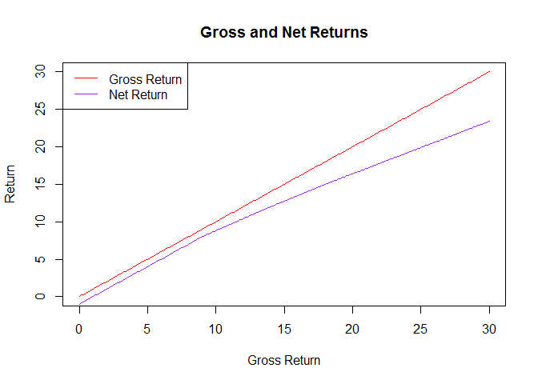
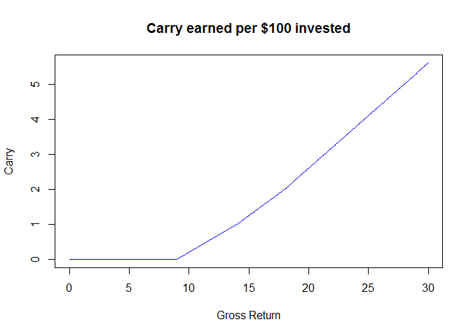
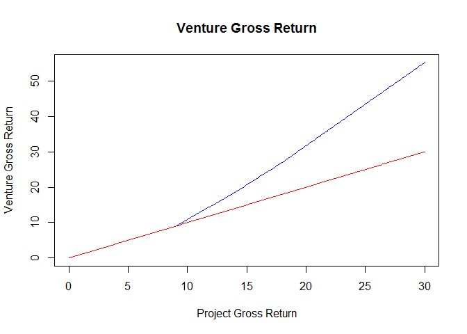
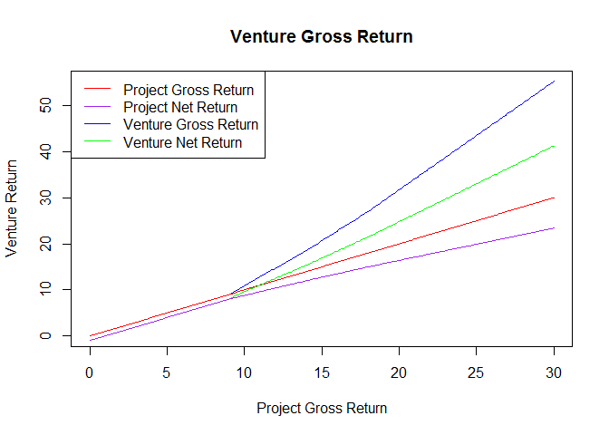
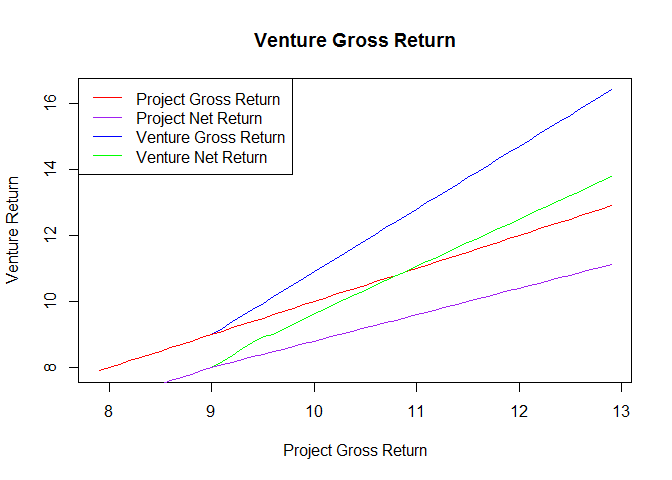
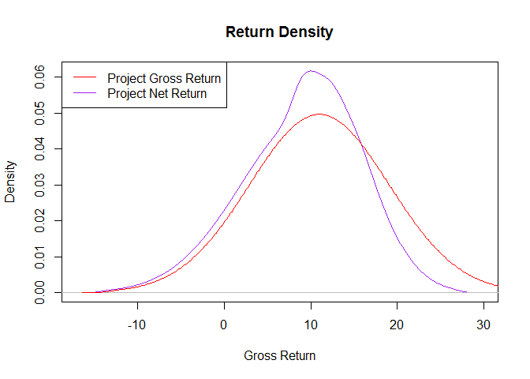
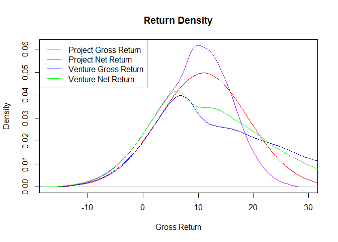
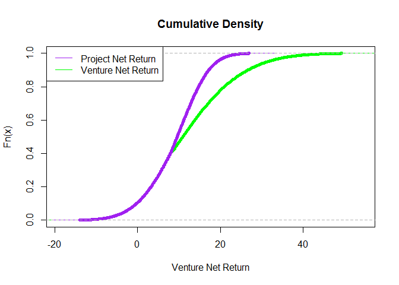

# Understanding the Operator X/Financial Sponsor Y Structure
Karl Polen  
Saturday, January 17, 2015  
Plan Sponsor ABC is negotiating a transaction with Operator X/Financial Sponsor Y to invest in multi-family properties in or around New York City.  The Plan Sponsor ABC/Operator X/Financial Sponsor Y entity, referred to as "venture", will provide equity to Operator X ("operator") which will then sponsor the projects. It is anticipated that Venture will provide approximately 10% of the required equity to project SPEs and that the remainder of the equity will be raised from third party institutional investors.

Plan Sponsor ABC will receive "no fee/no carry" interests in the project SPEs, but will pay conventional fee and carry terms at the Venture level.  However, Venture will receive 50% of any incentive fees earned at the project SPE.

The Venture waterfall is negotiated to be in the following structure:

* Tier 1 parri passu to a 9% pref 
* Tier 2 70/30 until rebated carry is paid to the parties 
* Tier 3 80/20 until 12% pref 
* Tier 4 75/25 until 15% pref 
* Tier 5 70/30 of remaining profit 

Additionally, Plan Sponsor ABC will pay an asset management fee of 1% of invested capital at Venture level.

For purposes of this analysis, we will assume that the project SPE will pay carry on the following schedule:

* Tier 1 parri passu to a 9% pref
* Tier 2 80/20 to 12% pref
* Tier 3 75/25 to 15% pref
* Tier 4 70/30 of remaining profit.

We assume the venture charges an asset management fee of 1% of invested capital.

First, let's analyze fees at the project SPE.  The following graph shows gross and net returns under this structure.


```r
source('waterfallqd.r')
dmat.df=data.frame(am=c(1,0,0),pref=c(8,12,15),catchup=c(0,0,0),carry=c(.2,.25,.3))
ret=100+seq(0,30,.1)
wat=waterfall(dmat.df,ret)
plot(wat$grossreturn,wat$grossreturn,col='red',type='l',main='Gross and Net Returns',
     ylab='Return',xlab='Gross Return')
lines(wat$grossreturn,wat$netreturn,col='purple')
legend('topleft',legend=c('Gross Return','Net Return'),col=c('red','purple'),lwd=1)
```

<!-- -->

For each hundred dollars invested, the general partner will earn the amount of carry shown in the following chart.


```r
carry=colSums(wat$gpshare[-1:-3,])
plot(wat$grossreturn,carry,col='blue',type='l',main='Carry earned per $100 invested',
     ylab='Carry',xlab='Gross Return')
```

<!-- -->

Now, let's turn to economics at the Venture level.  If we assume that the Venture provides 10% of the equity to the project SPE, then for every $100 invested by Venture the project SPE will earn a carry on the other $900.  Since the venture receives only half that carry, the gross at the venture level will be the gross at the project level plus 4.5 times the carry earned at that gross return.  This is illustrated in the following chart.


```r
venture.carry=4.5*carry
venture.gross=wat$grossreturn+venture.carry
plot(wat$grossreturn,venture.gross,col='blue',type='l',main='Venture Gross Return',
     ylab='Venture Gross Return',xlab='Project Gross Return')
lines(wat$grossreturn,wat$grossreturn,col='red')
```

<!-- -->

We now turn to the waterfall at the venture level.  This is tricky, because the sharing of carry at tier 2 can ovewhelm subsequent tiers.  So, we need to devise some code to deal with this.

We know that, absent carry rebate, distributions are made in the following fashion:

* First dollar goes to the asset management fee
* Next nine dollars go to the first tier pref
* money is then split 80/20 for 3.75 dollars (which gets Plan Sponsor ABC to a 12% IRR)
* money is then split 75/25 for 4 dollars (which gets Plan Sponsor ABC to a 15% IRR)
* the rest of the money is split 70/30

But, it there is, say, $2 of carry rebate then the waterfall is changed.  In that case, the waterfall works like this:

* First 10 dollars goes to asset management fee and pref (we know there is enough for this because if the carry rebate is $2, the chart above shows that the gross return is around 15%)
* The next $2 is distributed 70/30
* The 80/20 tier is calculated as follows  
      + Plan Sponsor ABC received $1.40 of the rebate, so it needs another $1.60 to get to 12%  
      + so the 80/20 layer is $1.60 divide by .8, or $2   
* The remainder of the money is distribued as described above.

So, now we develop a function that does this. The first graph shows results across a broad range of returns.  The second graph shows the same scenario, but as a close-up at the inflection points.


```r
# dwf is a function that works on an individual case and returns the lpshare as the answer
dwf=function(venture.gross,venture.carry) {
  if((venture.gross-1)<=0) return(venture.gross-1)
  venture.net=venture.gross-venture.carry
  layer.am=1
  layer.pref=9
  carryused=min(max(0,10-venture.net),venture.carry)
  carryleft=venture.carry-carryused
  layer.catchup=min(carryleft,carryused*(1/.7-1))
  layer.carry=carryleft-layer.catchup
  pwf=wf(c(3,3),layer.carry*.7)
  layer.80=pwf[1]/.8
  layer.75=pwf[2]/.75
  layers=c(layer.am,layer.pref,layer.catchup,layer.carry,layer.80,layer.75)
  splits=wf(layers,venture.gross)
  lpshare=c(0,1,0,.7,.8,.75,.7)
  ans=lpshare %*% splits
  return(ans)
}

# operatorwf works through vectors (of equal length) of gross and carry scenarios
operatorwf=function(venture.gross,venture.carry) {
  ans=vector()
  for (i in 1:length(venture.gross)) {
    ans[i]=dwf(venture.gross[i],venture.carry[i])
  }
  return(ans)
}
venture.lp=operatorwf(venture.gross,venture.carry)
plot(wat$grossreturn,venture.gross,col='blue',type='l',main='Venture Gross Return',
     ylab='Venture Return',xlab='Project Gross Return')
lines(wat$grossreturn,wat$grossreturn,col='red')
lines(wat$grossreturn,venture.lp,col='green')
lines(wat$grossreturn,wat$netreturn,col='purple')
legend('topleft',legend=c('Project Gross Return',
                          'Project Net Return',
                          'Venture Gross Return',
                          'Venture Net Return'),
       col=c('red','purple','blue','green'),lwd=1)
```

<!-- -->

```r
closeup=80:130
plot(wat$grossreturn[closeup],venture.gross[closeup],
     col='blue',type='l',main='Venture Gross Return',
     ylab='Venture Return',xlab='Project Gross Return')
lines(wat$grossreturn[closeup],wat$grossreturn[closeup],col='red')
lines(wat$grossreturn[closeup],venture.lp[closeup],col='green')
lines(wat$grossreturn[closeup],wat$netreturn[closeup],col='purple')
legend('topleft',legend=c('Project Gross Return',
                          'Project Net Return',
                          'Venture Gross Return',
                          'Venture Net Return'),
       col=c('red','purple','blue','green'),lwd=1)
```

<!-- -->

Now that we've built some tools to handle the mechanics, we're ready to do some analysis.

Suppose that project gross returns are normally distributed with a mean of 11% and standard deviation of 8%.


```r
mu=11
sd=8
ret.seq=seq(mu-3*sd,mu+3*sd,.1)
ret.den=dnorm(ret.seq,mu,sd)
ret.count=round(1000*ret.den)
ret2=100+rep(ret.seq,ret.count)
wat2=waterfall(dmat.df,ret2)
```

Now we are ready to plot a density function of the gross and net returns.


```r
with(wat2,plot(density(netreturn),col='purple',main='Return Density',xlab='Gross Return'))
with(wat2,lines(density(grossreturn),col='red'))
legend('topleft',legend=c('Project Gross Return','Project Net Return'),col=c('red','purple'),lwd=1)
```

<!-- -->

Let's add the venture gross and net to the graph.


```r
carry=colSums(wat2$gpshare[-1:-3,])
venture.carry=4.5*carry
venture.gross=wat2$grossreturn+venture.carry
venture.lp=operatorwf(venture.gross,venture.carry)
with(wat2,plot(density(netreturn),col='purple',main='Return Density',xlab='Gross Return'))
with(wat2,lines(density(grossreturn),col='red'))
lines(density(venture.gross),col='blue')
lines(density(venture.lp),col='green')
legend('topleft',legend=c('Project Gross Return',
                          'Project Net Return',
                          'Venture Gross Return',
                          'Venture Net Return'),
       col=c('red','purple','blue','green'),lwd=1)
```

<!-- -->

The next plot shows a comparison of the cumulative density on the Project and Venture net return.


```r
plot(ecdf(venture.lp),col='green',pch=20,
               main='Cumulative Density',xlab='Venture Net Return')
lines(ecdf(wat2$netreturn),col='purple',pch=20)
legend('topleft',legend=c("Project Net Return","Venture Net Return"),
       col=c('purple','green'),lwd=1)
```

<!-- -->

The Financial Sponsor Y/Operator X structure provides the Plan Sponsor ABC the opportunity to capture a portion of GP economics by receiving a share of GP carry on projects adequately profitable to earn carry.  Ther is no difference to Plan Sponsor ABC on the downside compared to standard venture terms.  However, on projects that earn a return above the hurdle rate Plan Sponsor ABC will receive a higher share of profits under these terms.
