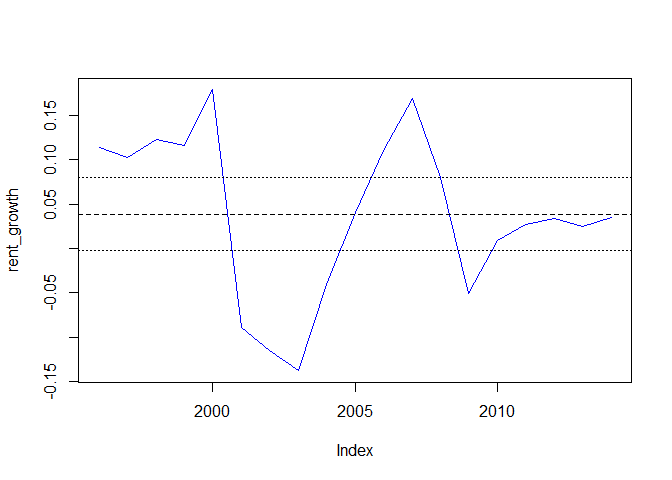

# Using statistics to estimate sensitivity ranges
Karl Polen  
Tuesday, May 12, 2015  


Let's work from the Austin CBD data you provided using effective rent from 1995 through 2015.  Here is a plot of the data with a regression line added.


```r
rent_rate=zooreg(c(13.81,15.59,17.36,19.8,22.41,27.28,25.05,
                   22.48,19.76,19,19.81,22.27,26.79,29.12,27.72,
                   27.96,28.74,29.76,30.53,31.65,32.88),freq=1,start=1995)
plot(rent_rate,col='blue')
rent_lm=lm(coredata(rent_rate)~time(rent_rate))
abline(rent_lm)
```

<!-- -->

Following are the statistics of the regression.


```r
summary(rent_lm)
```

```
## 
## Call:
## lm(formula = coredata(rent_rate) ~ time(rent_rate))
## 
## Residuals:
##     Min      1Q  Median      3Q     Max 
## -4.4960 -1.6761  0.0341  0.9578  6.8989 
## 
## Coefficients:
##                   Estimate Std. Error t value Pr(>|t|)    
## (Intercept)     -1537.0995   201.0893  -7.644 3.27e-07 ***
## time(rent_rate)     0.7787     0.1003   7.765 2.60e-07 ***
## ---
## Signif. codes:  0 '***' 0.001 '**' 0.01 '*' 0.05 '.' 0.1 ' ' 1
## 
## Residual standard error: 2.783 on 19 degrees of freedom
## Multiple R-squared:  0.7604,	Adjusted R-squared:  0.7478 
## F-statistic: 60.29 on 1 and 19 DF,  p-value: 2.604e-07
```

Note the standard error of the residual is $2.783.  You could use that as the estimate of the one sigma standard error on your estimate of base case rent.  Rounding to $3 for that estimate, your range on rent for sensitivity would be 20, 23, 26, 29 and 32.  This is a bit narrower than what you used.  As Paige noted, unless you remove the trend the volatility in rent estimates is exaggerated.  The regression analysis does this for you.

Note the slope of the regression shows rental increase $.7787 per year.  On a base case rent of $26, this is a growth rate of 2.99%.  That's pretty close to what you used.

However, the standard error on this growth is only $.1004 per year.  So, the two sigma confidence interval on rental growth based on this regression analysis is from 2.22% to 4%.  This feels too narrow to me.

Let's calculate with a different statistical method and see what we get.

Here are the growth rates plotted.I've added the mean (dashed line) and two sigma confidence interval (dotted lines). If you are reading the formulas, you will note that I scaled the standard deviation by the square root of the number of observations in order to make it relevant as the expected error in an estimate of a long term growth rate.  This yields a range for sensitivity on renta growth from 0 to about 7% -- this is very close to what you calculated using moving averages.  On a seven year hold, it's plausible to have zero growth, and that actually happened in 2000 to 2007.  It's also plausible to have 6% or 7% growth which happened from 2004 to about 2010.

It's worth noting that the actual growth is rarely close to the mean -- it's usually a lot more or a lot less and often outside the long term confidence interval. 


```r
#rent_growth=diff(log(rent_rate))  #use this formula if you want to use log growth
rent_growth=diff(rent_rate)/rent_rate[-length(rent_rate)]
rent_growth=zooreg(coredata(rent_growth),freq=1,start=1996)
plot(rent_growth,col='blue')
abline(h=mean(rent_growth),lty='dashed')
rent_growth_sd=sd(rent_growth)/sqrt(20)
abline(h=mean(rent_growth)+c(-2,2)*rent_growth_sd,lty='dotted')
```

<!-- -->

We used two standard statistical methods and got different results.  The moral of the story is to try different methods, apply judgment and use something that makes sense.  We normally would expect the worst case (two sigma downside) to be negative.  

You can do the regression analysis with Excel (data analysis button on the data ribbon).  I did it for grins and got the same answer.  Excel doesn't provide the standard error of the residual, but you can easily calculate it from the residuals provided.
