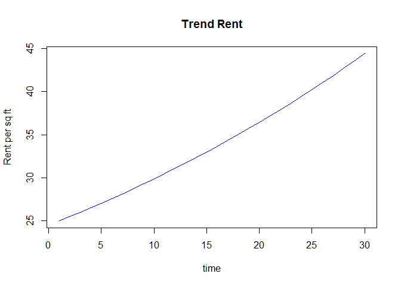
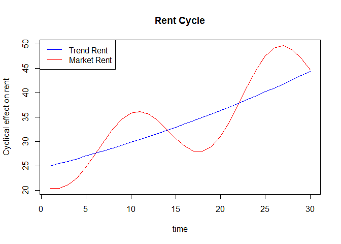

# Rent Trend with Cycle
Karl Polen  
Monday, February 16, 2015  

Let's suppose you think the office market is a boom bust cyclical market with an underlying growth trend driven by long growth in space demanded requiring new constrution from time to time.

Let's say the underlying rent growth is 2% per year driven by inflation in construction costs.  But there is a cycle to the rent where the market is occasionally oversupplied and the rent falls 20% below trend.  In that environment, new construction projects are cancelled and don't resume until rents revert to trend.  Because of lags in completion, by the time supply recovers rents accelerate to 20% above trend.  Then the cycle repeats itself.

The following is a calculation of trend rents assuming the required rent for new construction is $25.


```r
trend=grow(25,30,.02)
trend=zoo(trend,1:30)
plot(trend,ylab='Rent per sq ft', xlab='time', main='Trend Rent',col='blue')
```

<!-- -->

Now let's add the cyclical factor assuming the cycle repeats itself every 8 years and the trough is 20% below trend and the peak is 20% above trend.  Let's assume we are currently half way recovered from the trougn and current market rent is 10% below trend.


```r
amplitude=.2*trend
wavelength=8
cycle=sin(-2+0:29*(pi/wavelength))*amplitude
cycle=zoo(cycle,1:30)
market=trend+cycle
plot(market,ylab='Cyclical effect on rent',xlab='time',main='Rent Cycle',col='red')
lines(trend,col='blue')
legend('topleft',legend=c('Trend Rent','Market Rent'),col=c('blue','red'),lwd=1)
```

<!-- -->
